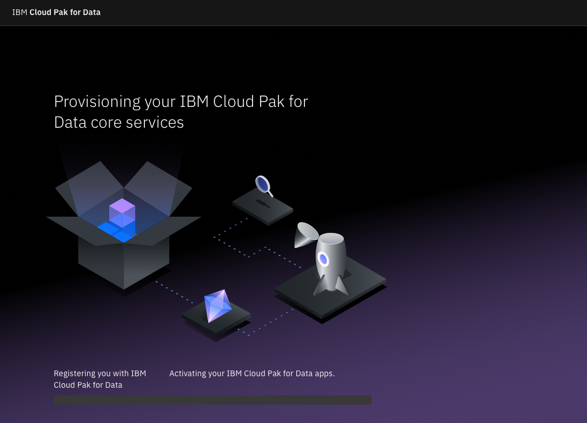

# Prerequisites

In this document you will learn how to:
* register an IBM Cloud account
* start your Cloud Pak for Data
* create your first project
* create your first deployment space with Machine Learning instance

## Step 1: Register your IBM Cloud account
* Go to https://cloud.ibm.com/registration. Enter your e-mail adress
  and desired password.

* Open your e-mail and copy the verification code. Paste it into your
  browser

* Enter your name and country

* Accept all the conditions, optionally permit e-mail marketing.

* Review and accept the privacy notice.

* You should now see your dashboad ready.

## Step 2: Quick start with IBM Cloud Pak for Data
* Go to http://dataplatform.cloud.ibm.com. Choose the region (Dallas).

* Choose "Log in with your IBMid".

* Wait for your IBM Cloud Pak for Data to start.

* Once you see the button, click it and go directly to your dashboard.

* (optional) You will see a pop-up for an in-platform tour. You may
  take it before continuing. Otherwise, simply close the window.
* You should now see your dashboard ready.

## Step 3: Create your first [project](https://dataplatform.cloud.ibm.com/docs/content/wsj/getting-started/projects.html?context=wdp&audience=wdp)
* Click on "New project" in "Projects" card under "Overview" headline

* Choose the "Empty project" option. Enter a name.
  Note: a new project already contains Cloud Object Storage.

* Wait for your project to initialize

* You should now see your project control board with you set as an
  Admin.

## Step 4. [Create](https://dataplatform.cloud.ibm.com/docs/content/wsj/analyze-data/ml-space-create.html?context=wdp&audience=wdp) your first [deployment space](https://dataplatform.cloud.ibm.com/docs/content/wsj/wmls/wmls-deploy-overview.html?context=wdp&audience=wdp) with [Machine Learning instance](https://dataplatform.cloud.ibm.com/docs/content/wsj/analyze-data/ml-service-instance.html?context=wdp&audience=wdp)
* Open the platform menu in the top-left corner

* Choose "Deployments" and then "View all spaces"

* You should see the list of all your deployment spaces, currently
  empty. Click either of the "New deployment space" buttons.

* Enter the name of your deployment and scroll down.

* Open the "Select the machine learning service" drop-down and choose
  "WatsonMachineLearning"

* Wait for your deployment space to be created

* When your deployment space is ready, click "View new space"

* You should now see your deployment space dashboard.

## Next
Continue to [Sample 1](./sample01.md)
