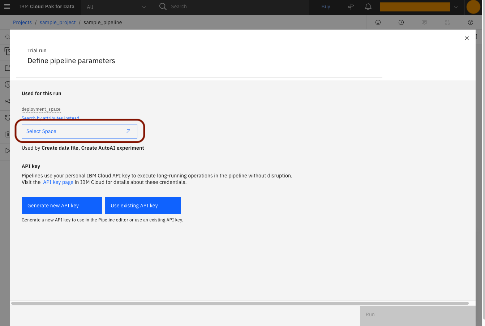
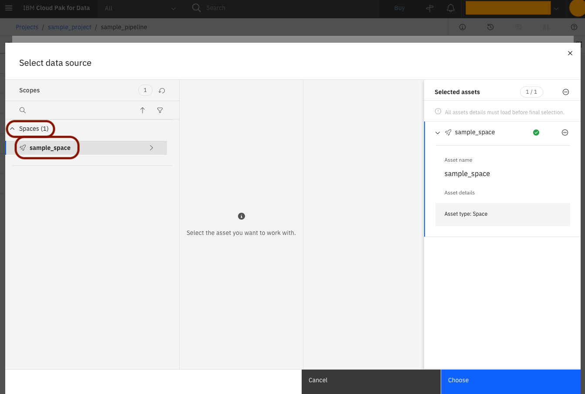
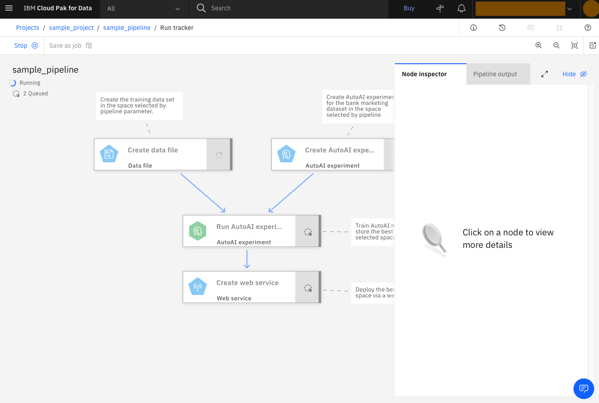
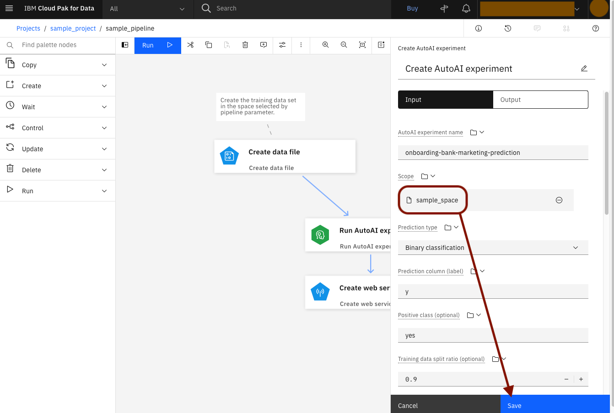
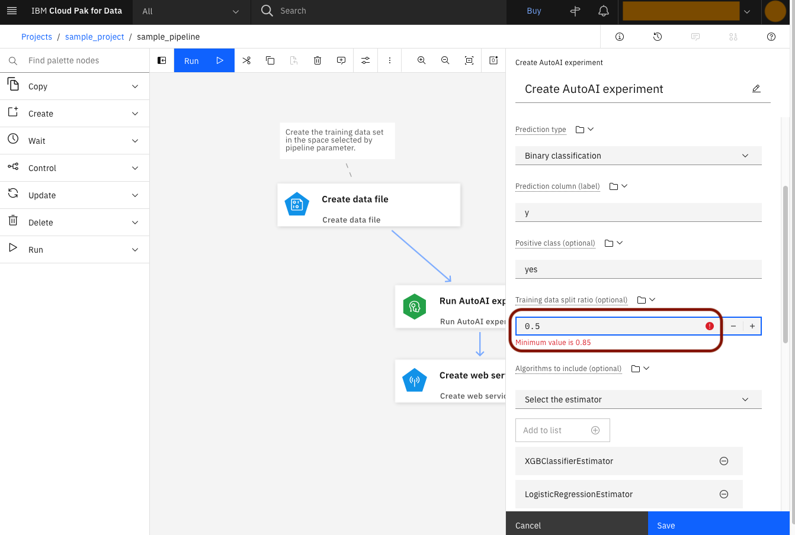
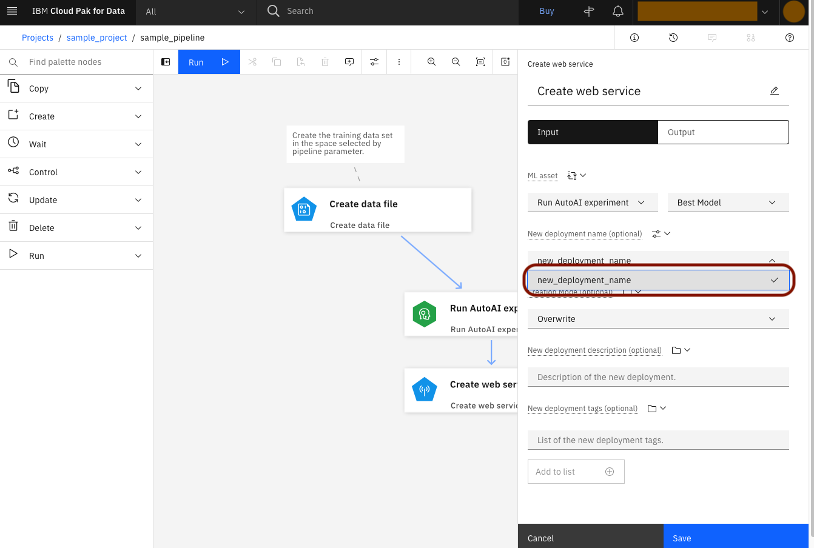

# Sample 1: Training AutoAI models

In this document you will learn how to:
* create a Watson Studio pipeline from gallery sample
* trigger trial run
* move around Tracking UI
* remove a pipeline parameter
* modify node parameters
* add a pipeline parameter

## Step 1: Create a [sample pipeline from gallery](https://dataplatform.cloud.ibm.com/docs/content/wsj/analyze-data/ml-orchestration-sample.html?context=wdp&audience=wdp)
* Open your dashboard at http://dataplatform.cloud.ibm.com. Note how
  now, the "Projects" card under "Overview" headline contains your
  project and "Deployment spaces" contains your deployment space.
  Click on your sample project.

* You should now see your project's dashboard. Click "Add to Project".

* You will see the list of assets that you can add to your project.
  Pick "Pipeline", which stands for Watson Studio Pipelines.

* Choose "Gallery sample" and then selectect te "Orchestration
  an AutoAI experiment" sample. Enter your pipeline name. Click
  "Create" in the bottom-right corner.

* Wait for your pipeline to be created.

* You should now see Watson Studio Pipelines UI with your sample
  pipeline opened in it.

## Step 2: Trigger trial run
* Open "Run" dropdown and pick "Trial Run". This will create
  a one-time run, as opposed to runs scheduled to execute periodically.

* You should see a window to declare the pipeline parameters of your
  run. Click "Select space" under the "deployment_space" parameter.

* You should see the data source browser. Select "Space" and then your
  deployment space. Confirm with "Choose" in the bottom-right corner.

* You are now back to the pipeline parameters window. Note how
  your deployment space's id is now visible instead of the "Select
  space" button. Proceed with generating the API key by clicking
  the "Generate new API key" button under API key header.

* Enter a name for your API key.

* Now your API key is created. You will be able to reuse it in
  the future runs.

  Click the Eye icon to show your API key. Copy and paste it to
  some safe location so that you won't lose it. It can NOT be shown
  ever again later (but you can generate a new one if you lose it).

* You are now back to the pipeline parameters window. Note how
  the API key is now chosen and the "Run" button in the bottom right
  corner is no longer gray. Click it to execute your run.

* Wait for your run to be created.

* After your run is created, you will see the execution tracking UI,
  where you can observe your pipeline run being executed.

## Step 3: Move around Tracking UI
* You are now in the Tracking UI. On the left, under your pipeline's
  name, you can see the status of the whole pipeline run (here:
  running) as well as the number of nodes with given statuses (below).

* On the right, you can see the Node Inspector with "Click on a node
  to see more details". After double-clicking "Create data file" node,
  you will see some information about it, such as its name, icon and
  component name. You will also see its logs being produced as it
  runs.

* Wait until the node changes its status to "Completed" (the green bar
  and tick symbol). You can now see the node status
  summary changed to either "1 Completed, 1 Running, 2 Queued"
  or "2 Completed, 1 Running, 1 Queued". Node that each number
  corresponds to the number of nodes.

* In the Node Inspector, click "Input/Output". You will now see
  the values of inputs and outputs of the "Create data file" node.
  Scroll down to see them all.

* Now choose a node which is currently running (the blue bar and
  waiting symbol), it will probably be either "Create AutoAI
  experiment" or "Run AutoAI experiment". Scroll down to see the
  outputs. You can see how, contrary to a Completed "Create data
  file", a running node has "Value unavailable" in the place its
  output values will later appear.

* You can widen or hide the Node Inspector by using the buttons
  in its top-right corner.

* Wait until all of the nodes are Completed. Now, the pipeline status
  changed from Running to Completed. You can see a path to your
  deployment by inspecting the outputs of "Create webservice".
  Note how it points at a deployment in your deployment space.

## Step 4: Remove a pipeline parameter
* Return to your pipeline-building UI by clicking the link in the top.

* Click on the Global Objects icon, between the Comments and Settings.

* You should now see the Global Objects windows, showing Pipeline
  Parameters. There is currently only one Pipeline Parameter,
  "deployment_space", currently used by two nodes. In the next few
  steps, you will remove the references to it and then remove the
  parameter itself.

  Click the Edit icon to try to modify it.

* You should now see the "deployment_space" Pipeline Parameter
  modification window. A part of it, however, is grayed-out and
  a you can see an info bar: "Unable to modify type - This pipeline
  parameter is currently being used in 2 nodes".

  Close with "Cancel" and then close the previous window
  with "Return to canvas".

* Choose "Create AutoAI experiment" node. Open the Source drop-down
  menu near "Scope" input, pick "Select resource".

* You can now see the "Select Scope" box. Click it.

* You should now see the "Select data source" window. This time,
  both Projects and Spaces are visible, as both projects and spaces
  are allowed as a scope for the "Scope" input of "Create AutoAI
  experiment".

  Choose "Spaces" and then your deployment space.

* Note how right now, your deployment space's name is visible
  under "Scope" input.

  Make sure to click "Save". Otherwise your changes to the node will
  be lost.

* Repeat the above steps for the "Path Scope" input
  of the "Create data file" node.

  Make sure to click "Save".

* Open the Global Objects window again. Now, the "deployment_space"
  parameter is assigned to no nodes. Try to modify it again.

* Now, that no nodes refer to the parameter, you can modify it freely.

  Click "Cancel".

* Click the Delete icon. Confirm the deletion.

* There are currently no Pipeline Params. Click "Return to canvas".

* Execute another Trial Run. This time, you will only see "API key",
  no "deployment_space". Also, your API key is already populated with
  the value you generated for the previous run. Click "Run".

* Wait for your run to complete. It should finish successfully and
  produce another deployment in your deployment space.

## Step 5: Explore modifying the pipeline
* Go back to the pipeline-building UI. Select "Create AutoAI
  experiment". Open the value dropdown for the "Algorithms to include"
  input. You will see a list of possible values to choose from. Pick
  "LogisticRegressionEstimator".

* There are currently two estimators already chosen:
  "GradientBoostingClassifierEstimator" and "XGBClassfierEstimator".
  You can remove either with the icon on their respective cards.
  Remove the "GradientBoostingClassifierEstimator".

  Click "Add to list" to add the chosen "LogisticRegressionEstimator".

* Now the "GradientBoostingClassifierEstimator" is removed and
  "LogisticRegressionEstimator" is added. The dropdown menu
  selection got reset to "Select the estimator", allowing you
  to choose yet another value to add.

* Edit the value in the "Training data split radio" input
  by entering 0.5. You will see a warning informing you that the
  minimum value is 0.85.

* Enter 0.85. The value will be accepted.

  Click "Save".

* Choose the "Run AutoAI experiment" node. Enter a value under
  the optional input "Model name prefix":
  "sample-bank-marketing-model-".

  Click "Save".

* Choose the "Create web service" node. Note that
  the optional input "New deployment name" is populated with
  a string literal
  "onboarding-bank-marketing-prediction-deployment".
  In the next few steps, you will create a pipeline parameter
  with that default value and assign that parameter to the input.

* Open the Global Objects menu. Click either of the "Add pipeline
  parameter" buttons.

* Enter name. Pick type "String". Paste
  "onboarding-bank-marketing-prediction-deployment"
  as the default value. Click "Add".

* You can now see the pipeline parameter on the list. Return
  to the canvas.

* Open the dropdown next to the "New deployment name". Choose "Assign
  pipeline parameter".

* You should only see one value in the dropdown, the name of the
  pipeline parameter that you have just created. Pick it.

* Create a Trial Run. Note that you can now see your newly created
  parameter with the default value that you provided.

## Next
Continue to [Sample 2](./sample02.md)
