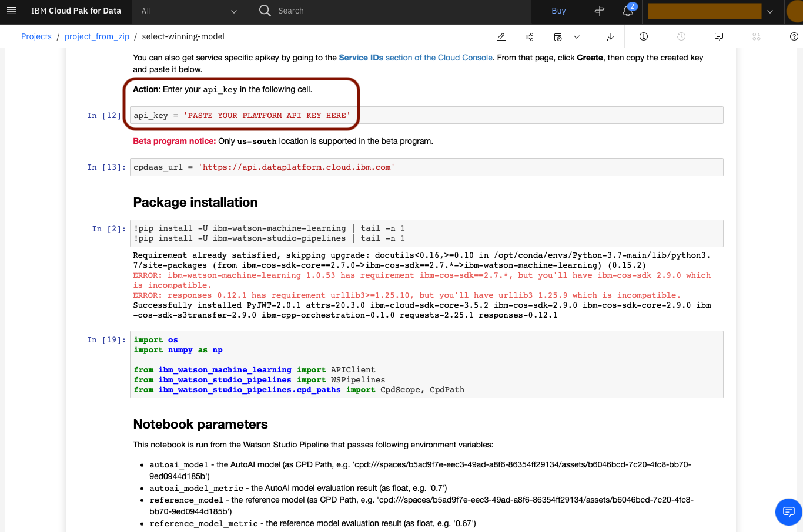
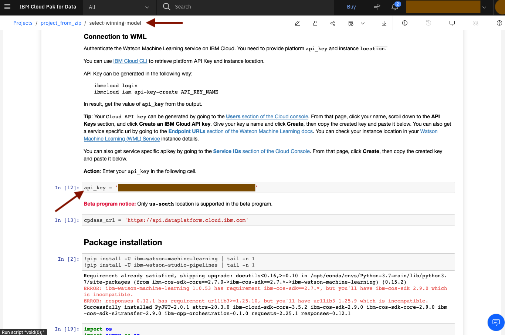

# Sample 2: Traing AutoAI + evaluate model

In this document you will learn how to:
* create project from gallery
* modify the "Run notebook" node in the pipeline
* modify notebook used by "Run notebook" node

## Step 1: [Import](https://dataplatform.cloud.ibm.com/docs/content/wsj/manage-data/import-project.html?context=wdp&audience=wdp) project from gallery
* Open your dashboard at http://dataplatform.cloud.ibm.com. Go to
  "Projects". You should now see the project form sample 1.
  Click on "New project".

* Choose "Create a project form a sample or file".

* You should now see the list of project samples to choose from. Choose
  "Train AutoAI and reference model".

* Choose the Machine Learning instance for your project. You can also
  modify the name and the description.

* Your project is now ready.

* Go to "Assets" to verify that the project is non-empty.


## Step 2: Modify the run-notebook node
* Scroll down to "Pipelines". You should only see a single entry. Click
  it.

* Pick the "Select winning model" node. In its "Notebook" input, you can
  see "Notebook name" option with value "select-winning-model".

* Scroll down. You can see the list of environmental variables passed to the
  notebook.

* Switch to "Outputs" tab. See the "Output variables" list, which
  contains one entry. These are the outputs that the notebook exposes
  back to the node.

* Go to "Global Objects" and add a new Pipeline Parameter. Choose
  "Double" type. Name it "expected_model_metric".

* Pick that Pipeline Parameter for the new value for environmental
  variables list.

* Add it. Make sure to click Save. You are now ready to edit the
  notebook itself to use your newly-defined Pipeline Parameter.


## Step 3: Modify the notebook asset
* Go back to your pojects. Click on "select-winning-model" notebook,
  the one that the "Select winning model" node is using.

* You should now see the notebook view. It is not editable right now,
  as no Python environment has been started yet.

* Scroll down. You will see that the notebook requests you to pass it
  your API key. This is done for security reasons. Please don't ever
  pass it as an environmental variable nor print it to the standard
  output.

* Scroll down. You will see how the notebook reads the environmental
  variables passed to it by the node.

* Scroll down. You will see the very model selection code.

* Scroll down. You will see how the results are stored by calling
  a method in the WSPipelines client. This call requires your API key,
  which is why it was requested above.

* Now that you have the basic understanding of the notebook's structure,
  click the Edit icon

* Wait for the Python environment to initialize.

* You can now edit your notebook.

  Add the code to read your new env-var:
  ```python
  EXPECTED_MODEL_METRIC = float(os.getenv('expected_model_metric'))
  ```

* Add a condition on the relationship of the selected model's metric and
  your env-var. Simply assert or raise an exception.

  ```python
  if AUTOAI_MODEL_METRIC > REFERENCE_MODEL_METRIC:
      print('Selected AutoAI model')
      selected_model_id = AUTOAI_MODEL_ID
      selected_model = AUTOAI_MODEL
      selected_metric = AUTOAI_MODEL_METRIC
  else:
      print('Selected reference model')
      selected_model_id = REFERENCE_MODEL_ID
      selected_model = REFERENCE_MODEL
      selected_metric = REFERENCE_MODEL_METRIC
  ```
  ```python
  if selected_metric < EXPECTED_MODEL_METRIC:
      raise RuntimeError(f"Selected metric value too low! Expected at least: {EXPECTED_MODEL_METRIC}, but got: {selected_metric}")
  ```

* Make sure to also insert your API key

* Make sure to click "Save" and "Save version". You will see a green
  communicate on the right side of your screen to confirm your notebook
  is now saved.

* Paste your API key to the other notebook too. Make sure to "Save" and
  "Save version".

* You are now ready to run your pipeline.

## Step 4: Run the pipeline
* Open the pipeline and trigger a Trial Run. Populate "deployment_space"
  parameter with your deployment space and "expected_model_metric" with
  0.8

* Wait for your run to complete. Your notebook will probably fail.
  Go to "Select winning model". You can see the error message of your
  choice in the logs.

* Trigger another Trial Run. This time, use 0.5 as the value.

* Your run should now complete successfully.

